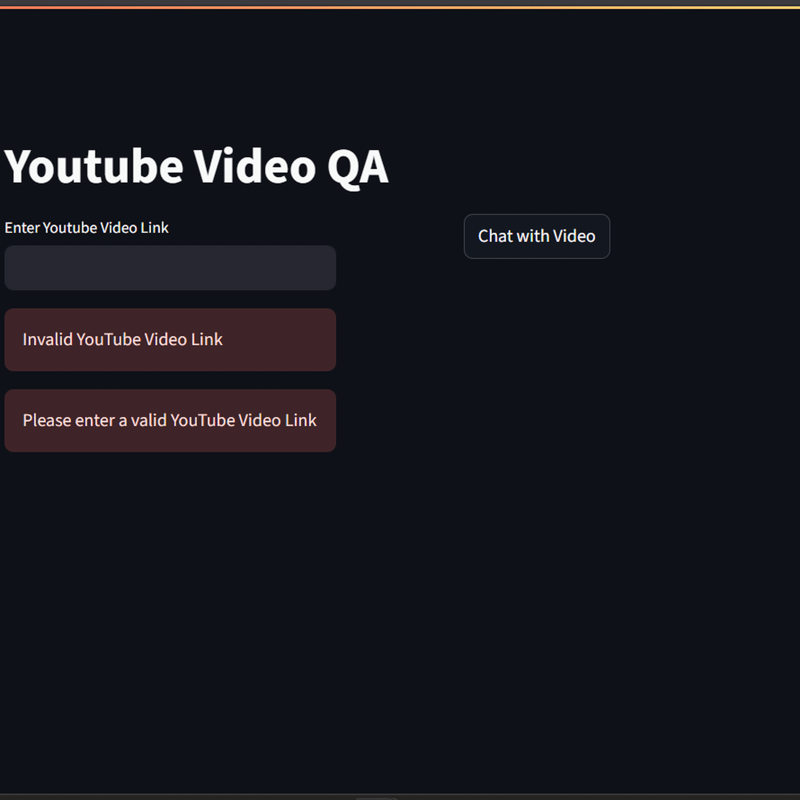

# 🤖 Q&A Bot for YouTube Videos 🎥

A Streamlit-powered application that lets you **ask questions** about the content of a YouTube video and get contextual answers, powered by Retrieval Augmented Generation (**RAG**) and embeddings.

 

---

## ✨ Features
- 📜 **Automatic transcript extraction** from YouTube videos  
- 🧩 **Chunking & embeddings** to index video transcripts efficiently  
- 🧠 **RAG pipeline**: retrieves relevant transcript parts and generates answers  
- 🖼 **Streamlit UI**: clean interface to enter a video URL and ask questions  
- 🧪 Supports free, local embedding models (no paid APIs needed)

---

## ⚙️ How it works
1. Enter a **YouTube video ID** or URL.
2. The app extracts the transcript (auto-generated or manual).
3. Transcript is split into chunks and embedded.
4. When you ask a question, relevant chunks are retrieved.
5. A language model answers your question using retrieved context.

---

## 🚀 Quick start

### 1️⃣ Clone the repo
```bash
git clone https://github.com/Kkoderr/q-a_bot.git
cd q-a_bot
````

### 2️⃣ Create & activate virtual environment

```bash
# macOS/Linux
python -m venv .venv
source .venv/bin/activate

# Windows
python -m venv .venv
.venv\Scripts\activate
```

### 3️⃣ Install dependencies

```bash
pip install -r requirements.txt
```

### 4️⃣ Run the Streamlit app

```bash
streamlit run app.py
```

Then open [http://localhost:8501](http://localhost:8501) in your browser.

---

## 📦 Project structure

```
├── app.py            # Streamlit front-end
├── ragSys.py         # RAG logic (embedding, retrieval)
├── bot.py            # Handles LLM call & prompt
├── requirements.txt
└── README.md
```

---

## 🔑 API keys

If using external LLMs (e.g., Google Gemini, Cohere):

1. Create a `.env` file in the project root:

```
COHERE_API_KEY=your_key_here
GOOGLE_API_KEY=your_key_here
```

2. Load them in your code:

```python
from dotenv import load_dotenv
load_dotenv()
```

> ✅ Tip: don’t commit your `.env` file to version control.

---

## 🧠 Built with

* [Streamlit](https://streamlit.io/) – web UI
* [YouTube Transcript API](https://github.com/jdepoix/youtube-transcript-api) – extract transcripts
* [LangChain](https://python.langchain.com/) – RAG pipeline
* Free embedding models from Hugging Face

---

## 📍 To do / ideas

* [ ] Add multi-language support
* [ ] Improve chunking with semantic splitting
* [ ] Cache transcripts & embeddings
* [ ] Deploy on Hugging Face Spaces or Streamlit Community Cloud

---

## 🤝 Contributing

PRs, issues and suggestions are very welcome!
Please open an issue first to discuss what you’d like to change.

---

## 📄 License

This project is open source under the **MIT License**.

---

## ⭐️ Show your support

If you find this useful, please ⭐️ the repo!
